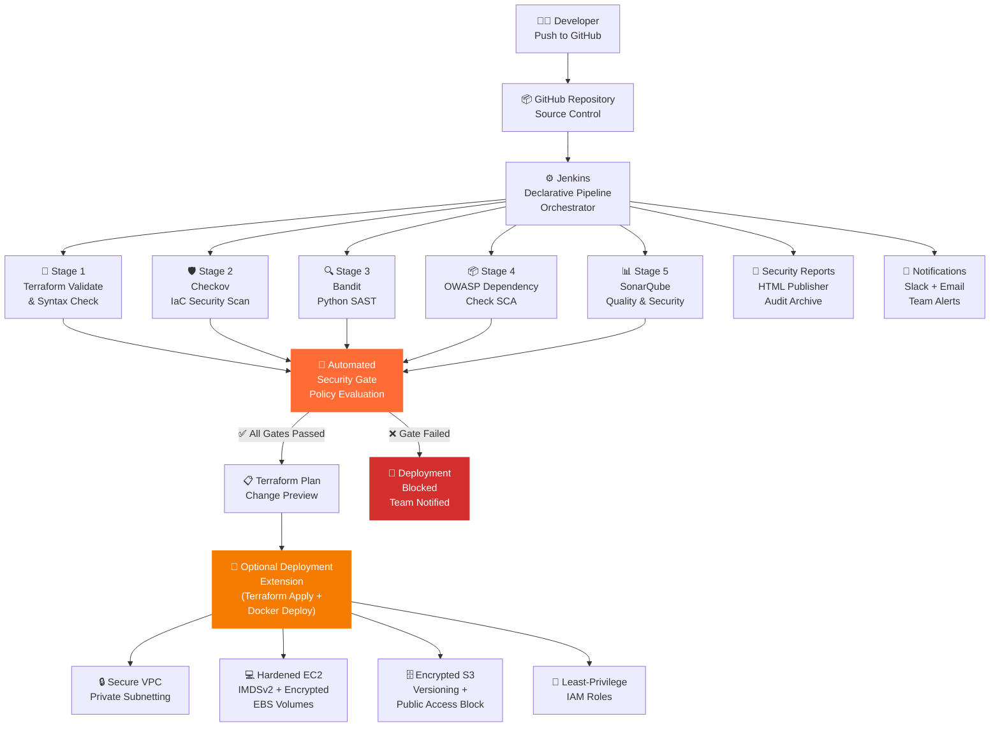
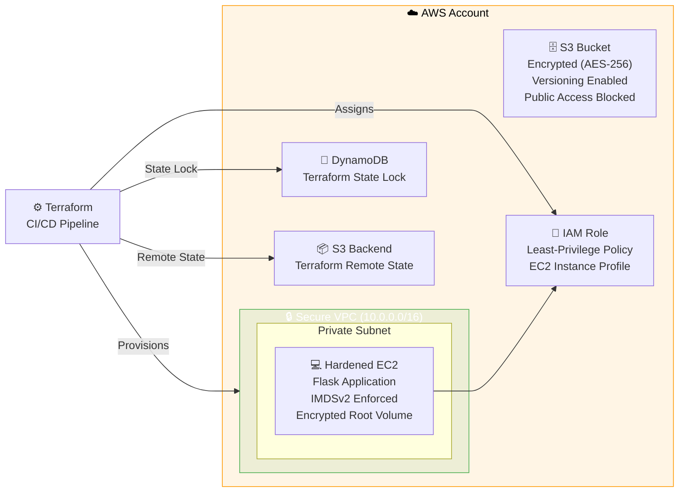

<div align="center">

# 🔐 DevSecOps Security Pipeline

### Enterprise-Grade CI/CD Security Automation | Shift-Left Security | Policy-Enforced Deployment Gates

[](https://www.jenkins.io/)
[](https://www.terraform.io/)
[](https://www.docker.com/)
[](https://aws.amazon.com/)
[](https://www.python.org/)
[](https://www.sonarqube.org/)

[](https://www.checkov.io/)
[](https://bandit.readthedocs.io/)
[](https://owasp.org/www-project-dependency-check/)
[](LICENSE)
[](Jenkinsfile)
[](CONTRIBUTING.md)


---

*A production-style DevSecOps pipeline demonstrating automated security validation across infrastructure, application code, and dependencies — enforcing policy-based deployment gates before any code reaches AWS.*

</div>

---

## 📋 Table of Contents

- [Executive Summary](#-executive-summary)
- [Project Status](#-project-status)
- [Architecture](#-architecture)
- [Security Controls Matrix](#-security-controls-matrix)
- [Pipeline Workflow](#-pipeline-workflow)
- [Technologies Used](#-technologies-used)
- [Real-World DevSecOps Concepts Demonstrated](#-real-world-devsecops-concepts-demonstrated)
- [Cloud Security & DevSecOps Skills Demonstrated](#-cloud-security--devsecops-skills-demonstrated)
- [Key Achievements](#-key-achievements)
- [Business Value](#-business-value)
- [Screenshots](#-screenshots)
- [Getting Started](#-getting-started)
- [Security Scan Commands](#-security-scan-commands)
- [Deployment Policy Thresholds](#-deployment-policy-thresholds)
- [Lessons Learned During Implementation](#-lessons-learned-during-implementation)
- [Interview Questions This Project Helps Answer](#-interview-questions-this-project-helps-answer)
- [Resume Impact](#-resume-impact)
- [Future Enhancements](#-future-enhancements)

---

## 🎯 Executive Summary

This project implements a **production-grade DevSecOps CI/CD security pipeline** that integrates automated security validation at every stage of the software delivery lifecycle. Built around Jenkins declarative pipelines, it orchestrates four distinct security scanning domains — Infrastructure-as-Code analysis, Static Application Security Testing, Software Composition Analysis, and Code Quality Gating — before a single line of infrastructure is provisioned or application code is deployed.

The pipeline enforces **policy-based security gates** that automatically block deployments when findings exceed defined thresholds. This eliminates the reliance on manual security reviews, reduces the window between vulnerability introduction and detection, and operationalizes shift-left security as an engineering practice rather than a downstream audit process.

**Core capabilities delivered:**

- Terraform infrastructure validated and scanned before any AWS resource provisioning
- Flask application code analyzed for security vulnerabilities via SAST prior to deployment
- Python dependency CVEs evaluated against CVSS scoring thresholds before packaging
- SonarQube Quality Gates enforced as a non-negotiable deployment prerequisite
- Terraform infrastructure validated, scanned, and planned — optional AWS deployment extension staged for completion
- Flask application containerized with Docker; deployment extension scoped as the next implementation phase
- Security reports published and archived on every pipeline run for audit traceability

This project models the security posture expected of cloud-native teams operating in regulated or security-sensitive environments and demonstrates hands-on proficiency across the full DevSecOps toolchain.

---

## ⚡ Highlights

| | |
|---|---|
| ✔ **End-to-End DevSecOps Pipeline** | ✔ **Policy-Based Security Gates** |
| ✔ **SonarQube Quality Gate Enforcement** | ✔ **Dockerized Security Tooling** |
| ✔ **Checkov IaC Security Scanning** | ✔ **AWS Infrastructure Security Controls** |
| ✔ **Bandit SAST Integration** | ✔ **Shift-Left Security Automation** |
| ✔ **OWASP Dependency Scanning** | ✔ **Automated Deployment Blocking** |

---

## 📊 Project Status

| Component | Status | Description |
|---|---|---|
| Jenkins Declarative Pipeline | ✅ Complete | Full multi-stage pipeline with post-condition handling |
| Terraform Validation | ✅ Complete | `terraform validate` and `terraform plan` integrated as pipeline stages |
| Checkov IaC Scanning | ✅ Complete | Scans all Terraform modules; blocks on high/critical findings |
| Bandit SAST Integration | ✅ Complete | Python source scanned; HTML report published to Jenkins |
| OWASP Dependency Check | ✅ Complete | CVE scanning against CVSS threshold; HTML report archived |
| SonarQube Integration | ✅ Complete | Scanner integrated; project analysis published on every run |
| SonarQube Quality Gates | ✅ Complete | Pipeline polls Quality Gate status; blocks on failure |
| Security Gate Enforcement | ✅ Complete | Consolidated gate evaluates all scanner results before deploy |
| Docker Networking | ✅ Complete | Jenkins, SonarQube, and app containers networked via shared bridge |
| AWS Deployment Extension (Terraform Apply + Docker Deploy) | 🚧 In Progress | Optional extension; pipeline validated through security gates and Terraform plan — live AWS apply staged for future completion |

---

## 🏗 Architecture

### Pipeline Flow



### AWS Infrastructure Topology



---

## 🛡️ Security Controls Matrix

| Control | Tool | Layer | Scope | Enforcement | Threshold |
|---|---|---|---|---|---|
| **IaC Security Scanning** | Checkov | Infrastructure | Terraform `.tf` files | ❌ Fails build | High / Critical findings |
| **SAST** | Bandit | Application | Python source code | ❌ Fails build | High / Critical severity |
| **SCA / Dependency CVE** | OWASP Dependency Check | Dependencies | `requirements.txt` + packages | ❌ Fails build | CVSS score ≥ 7.0 |
| **Code Quality Gate** | SonarQube | Application | Full codebase analysis | ❌ Fails build | Quality Gate status = FAILED |
| **Security Hotspot Review** | SonarQube | Application | Security-relevant code patterns | ⚠️ Warning | Requires manual review |
| **Terraform State Security** | S3 + DynamoDB | Infrastructure | Remote state backend | 🔒 Enforced | Encryption + lock always on |
| **Encryption at Rest** | AWS KMS / AES-256 | Data | EBS volumes, S3 buckets | 🔒 Enforced | No unencrypted resources |
| **Instance Metadata Security** | IMDSv2 | Runtime | EC2 metadata endpoint | 🔒 Enforced | v1 disabled, v2 required |
| **Network Isolation** | AWS VPC | Network | All AWS resources | 🔒 Enforced | Private subnets, SGs |
| **Least Privilege** | AWS IAM | Identity | All service roles | 🔒 Enforced | Minimal permissions only |
| **Audit Reporting** | Jenkins HTML Publisher | Compliance | All scan outputs | 📋 Archived | Every pipeline run |

---

## 🔄 Pipeline Workflow

Each stage is a discrete security or deployment gate. A failure in any security stage halts the pipeline before infrastructure is touched.

```
┌─────────────────────────────────────────────────────────────────────────────────┐
│  STAGE 1 │ Source Checkout                                                       │
│          │ Git clone from GitHub; workspace prepared for all downstream stages   │
└──────────┴──────────────────────────────────────────────────────────────────────┘
           ↓
┌─────────────────────────────────────────────────────────────────────────────────┐
│  STAGE 2 │ Terraform Validation                                                  │
│          │ terraform init → terraform validate → syntax and provider check       │
│          │ Fails on: malformed HCL, unresolvable provider references             │
└──────────┴──────────────────────────────────────────────────────────────────────┘
           ↓
┌─────────────────────────────────────────────────────────────────────────────────┐
│  STAGE 3 │ Checkov IaC Security Scan                                             │
│          │ Scans all Terraform modules against CIS, NIST, PCI-DSS benchmarks     │
│          │ Fails on: high/critical misconfigurations (unencrypted resources,      │
│          │           open security groups, missing logging, public exposure)      │
└──────────┴──────────────────────────────────────────────────────────────────────┘
           ↓
┌─────────────────────────────────────────────────────────────────────────────────┐
│  STAGE 4 │ Python Dependency Install + Lint                                      │
│          │ pip install into virtual environment; lightweight syntax validation    │
└──────────┴──────────────────────────────────────────────────────────────────────┘
           ↓
┌─────────────────────────────────────────────────────────────────────────────────┐
│  STAGE 5 │ Bandit SAST                                                           │
│          │ Static analysis of all Python source files in /app                    │
│          │ Fails on: hardcoded credentials, shell injection, debug mode,         │
│          │           unsafe deserialization, weak cryptography                   │
└──────────┴──────────────────────────────────────────────────────────────────────┘
           ↓
┌─────────────────────────────────────────────────────────────────────────────────┐
│  STAGE 6 │ OWASP Dependency Check (SCA)                                          │
│          │ Resolves dependency graph; queries NVD CVE database                   │
│          │ Fails on: any dependency with CVSS score ≥ 7.0                        │
└──────────┴──────────────────────────────────────────────────────────────────────┘
           ↓
┌─────────────────────────────────────────────────────────────────────────────────┐
│  STAGE 7 │ SonarQube Analysis + Quality Gate                                     │
│          │ Full code analysis: bugs, vulnerabilities, code smells, coverage      │
│          │ Pipeline polls Quality Gate API; blocks on FAILED status              │
└──────────┴──────────────────────────────────────────────────────────────────────┘
           ↓
┌─────────────────────────────────────────────────────────────────────────────────┐
│  STAGE 8 │ Consolidated Security Gate Evaluation                                 │
│          │ Aggregates findings across all scanners; evaluates against policy     │
│          │ CRITICAL findings → Fail build immediately                            │
│          │ HIGH findings > 0  → Fail build                                       │
│          │ MEDIUM findings > 5 → Warning (non-blocking)                          │
│          │ LOW findings       → Report only                                      │
└──────────┴──────────────────────────────────────────────────────────────────────┘
           ↓ (only if all gates pass)
┌─────────────────────────────────────────────────────────────────────────────────┐
│  STAGE 9 │ Terraform Plan                                                        │
│          │ Generates execution plan against target AWS environment               │
│          │ Plan artifact archived for review and audit                           │
└──────────┴──────────────────────────────────────────────────────────────────────┘
           ↓
┌─────────────────────────────────────────────────────────────────────────────────┐
│  STAGE 10│ Optional Deployment Extension — Terraform Apply                       │
│          │ Provisions / updates AWS infrastructure from approved plan             │
│          │ 🚧 Staged for completion — credentials and backend configured;         │
│             live AWS apply is the planned next phase of this project              │
└──────────┴──────────────────────────────────────────────────────────────────────┘
           ↓
┌─────────────────────────────────────────────────────────────────────────────────┐
│  STAGE 11│ Optional Deployment Extension — Docker Build & Deploy                 │
│          │ Flask application containerized and deployed to EC2                    │
│          │ 🚧 Staged for completion alongside Terraform Apply extension           │
└──────────┴──────────────────────────────────────────────────────────────────────┘
           ↓
┌─────────────────────────────────────────────────────────────────────────────────┐
│  POST    │ Report Publishing + Team Notification                                  │
│          │ HTML security reports archived via Jenkins HTML Publisher              │
│          │ Slack / Email notification sent with pipeline status and summary       │
└──────────┴──────────────────────────────────────────────────────────────────────┘
```

---

## 🧰 Technologies Used

| Category | Technology | Purpose |
|---|---|---|
| **CI/CD Orchestration** | Jenkins (Declarative Pipeline) | Pipeline execution, stage orchestration, report publishing |
| **Source Control** | GitHub | Version control, webhook-triggered pipeline runs |
| **Infrastructure as Code** | Terraform | AWS resource provisioning, remote state, module management |
| **IaC Security** | Checkov | Policy-as-code scanning against CIS/NIST benchmarks |
| **SAST** | Bandit | Python static analysis for security anti-patterns |
| **SCA** | OWASP Dependency Check | CVE detection across Python dependency graph |
| **Code Quality** | SonarQube | Bugs, vulnerabilities, code smells, quality gate enforcement |
| **Containerization** | Docker | Application packaging, local environment orchestration |
| **Cloud Platform** | AWS (VPC, EC2, S3, IAM) | Target deployment infrastructure |
| **Application** | Python Flask | Intentionally vulnerable and secure app variants for SAST demo |

---

## 💡 Real-World DevSecOps Concepts Demonstrated

### Shift-Left Security
Security validation is integrated at the earliest possible stages — before infrastructure is planned and before code is packaged. Vulnerabilities are caught in the pipeline, not discovered post-deployment through incident response.

### Policy-as-Code
Security policy is not a document — it is executable code. Checkov configuration files, Bandit YAML rules, and CVSS thresholds define organisational security standards that are automatically enforced on every commit.

### Defense in Depth Across the SDLC
Four independent scanning domains provide layered detection: IaC scanning catches infrastructure misconfigurations, SAST catches insecure code patterns, SCA catches vulnerable dependencies, and Quality Gates enforce maintainability thresholds. No single scanner is a single point of failure.

### Separation of Concerns in Security Gates
Warnings are decoupled from deployment blockers. Medium findings surface as non-blocking warnings to avoid alert fatigue, while Critical and High findings are hard stops. This mirrors how mature security programs operate — distinguishing between risks that must be resolved and risks that are tracked and accepted.

### Immutable Infrastructure via Terraform
AWS infrastructure is never modified manually. All changes flow through the pipeline, through version control, and through the security gate — creating a complete audit trail for every infrastructure state transition.

### Secure-by-Default AWS Design
Infrastructure is designed with security as the baseline: private networking, encrypted storage at rest, IMDSv2 enforcement, and least-privilege IAM — not retrofitted as an afterthought.

### Intentional Vulnerability Demonstration
The repository includes both a vulnerable app (`app.py`) and a remediated version (`secure_app.py`), demonstrating the ability to identify, understand, and remediate common security anti-patterns including hardcoded secrets, shell injection, and debug exposure.

---

## ☁️ Cloud Security & DevSecOps Skills Demonstrated

### Cloud Security
| Skill | Implementation |
|---|---|
| AWS Security Architecture | VPC design with private subnets, NACLs, and security groups |
| Encryption at Rest | AES-256 on all S3 buckets and EBS volumes |
| IAM Least Privilege | Role-based access with minimal permissions scoped to service needs |
| EC2 Hardening | IMDSv2 enforced; no public IPs; encrypted root volumes |
| Secure Remote State | Terraform state in encrypted S3 with DynamoDB state locking |

### DevSecOps Engineering
| Skill | Implementation |
|---|---|
| CI/CD Security Automation | Jenkins pipeline integrating 4 security scanning tools |
| Shift-Left Security | All security validation runs before plan/apply |
| Security Gate Design | Policy thresholds mapped to severity levels with blocking logic |
| Automated Compliance | Checkov benchmarks validate CIS/NIST controls on every commit |
| Vulnerability Management | CVSS-based SCA thresholds automate triage decisions |
| Security Reporting | HTML reports archived per run for audit trail |

### Infrastructure as Code
| Skill | Implementation |
|---|---|
| Terraform Modules | Modular resource definitions for VPC, EC2, S3, IAM |
| Remote State Management | S3 backend with DynamoDB locking; no local state |
| IaC Security Scanning | Checkov integrated into pipeline before `terraform plan` |
| Environment Parameterisation | Variables-driven deployment targeting dev/staging/prod |

### Application Security
| Skill | Implementation |
|---|---|
| SAST | Bandit identifying injection, hardcoded secrets, debug exposure |
| SCA | OWASP Dependency Check against NVD CVE database |
| Secure Coding Practices | `secure_app.py` demonstrates remediation of all identified issues |
| Security Hotspot Review | SonarQube flags patterns requiring manual security review |

---

## 🏆 Key Achievements

- **Automated 100% of pre-deployment security validation** — eliminating manual security review from the deployment process
- **Integrated four independent security scanning domains** into a single consolidated gate with consistent enforcement logic
- **Implemented policy-based deployment blocking** that mirrors enterprise security compliance requirements
- **Deployed hardened AWS infrastructure via Terraform** meeting encryption, network isolation, and least-privilege standards
- **Demonstrated both vulnerable and secure application variants** to validate SAST detection accuracy and document remediation patterns
- **Published security reports as first-class pipeline artifacts**, establishing audit traceability for every build

---

## 💼 Business Value

| Value Driver | Impact |
|---|---|
| **Reduced Mean Time to Detection** | Security issues caught at commit time rather than post-deployment |
| **Elimination of Manual Security Reviews** | Automated gates replace slow, inconsistent human review for common vulnerability classes |
| **Audit Readiness** | Every pipeline run produces archived security reports supporting compliance audit workflows |
| **Deployment Confidence** | Engineers deploy knowing infrastructure and code have passed automated security validation |
| **Consistent Policy Enforcement** | Security standards applied identically to every commit — no human inconsistency |
| **Developer Security Feedback Loop** | SAST and SCA results visible in the pipeline, enabling fast developer-driven remediation |

---

## 📸 Screenshots

> *Pipeline screenshots captured from local Jenkins and SonarQube environment.*

### Jenkins Pipeline — Full Stage View
```
📸 [ Screenshot: Jenkins Blue Ocean pipeline showing all stages with status indicators ]
    Location: docs/screenshots/jenkins-pipeline-full.png
```

### SonarQube Dashboard — Quality Gate Passed
```
📸 [ Screenshot: SonarQube project dashboard showing Quality Gate: Passed, 0 bugs, 0 vulnerabilities ]
    Location: docs/screenshots/sonarqube-dashboard.png
```

### Security Gate Results — Build Blocked
```
📸 [ Screenshot: Jenkins console output showing security gate evaluation and blocked deployment ]
    Location: docs/screenshots/security-gate-blocked.png
```

### Security Reports — Jenkins HTML Publisher
```
📸 [ Screenshot: Jenkins build page with Bandit, Checkov, and Dependency Check HTML report links ]
    Location: docs/screenshots/jenkins-security-reports.png
```

### OWASP Dependency Check Report
```
📸 [ Screenshot: Dependency Check HTML report showing CVE summary and CVSS scores ]
    Location: docs/screenshots/dependency-check-report.png
```

---

## 🚀 Getting Started

### Prerequisites

Ensure the following are available before running the pipeline:

| Requirement | Notes |
|---|---|
| Jenkins (LTS) | With Docker, Python 3, Terraform, Checkov, Bandit, Dependency Check, SonarScanner |
| Jenkins Plugins | Pipeline, HTML Publisher, SonarQube Scanner, AWS Credentials, Slack Notification |
| Docker Engine | For Jenkins agent and SonarQube containerised deployment |
| AWS Credentials | Stored in Jenkins as `aws-devsecops-deploy` |
| SonarQube Token | Stored in Jenkins as `sonarqube-token` |
| Terraform Backend | S3 bucket and DynamoDB table provisioned before first run |

### Run Flask Application Locally

```bash
git clone https://github.com/<your-username>/DevSecOps-Security-Pipeline.git
cd DevSecOps-Security-Pipeline
python -m venv .venv
source .venv/bin/activate
pip install -r app/requirements.txt
python app/app.py
```

---

## 🔬 Security Scan Commands

Run individual security tools outside the pipeline for development-time validation:

```bash
# IaC Security Scan — Checkov against Terraform modules
checkov -d terraform --config-file security/checkov.yml

# SAST — Bandit Python static analysis with HTML output
bandit -r app -c security/bandit.yml -f html -o reports/bandit-report.html

# SCA — OWASP Dependency Check against Python dependencies
dependency-check.sh \
  --project "DevSecOps Security Pipeline" \
  --scan app \
  --format HTML \
  --out reports

# Terraform — Validate, plan, and apply
cd terraform
terraform init
terraform validate
terraform plan -var="environment=dev"
# terraform apply -var="environment=dev"   # Optional deployment extension — staged for next phase
```

---

## 🚦 Deployment Policy Thresholds

The Security Gate evaluates consolidated findings against the following policy:

| Severity | Threshold | Enforcement | Rationale |
|---|---|---|---|
| **Critical** | Any finding | ❌ Fail — block deploy | Critical vulnerabilities present unacceptable risk |
| **High** | > 0 findings | ❌ Fail — block deploy | High findings should be remediated before any deployment |
| **Medium** | > 5 findings | ⚠️ Warning — non-blocking | Tracked and surfaced; acceptable with documented exceptions |
| **Low** | Any count | 📋 Report only | Logged for visibility; does not affect deployment decision |

---

## 📚 Lessons Learned During Implementation

### Docker Networking
Connecting Jenkins, SonarQube, and the Flask application containers required explicit shared bridge network configuration. Default Docker networking isolates containers by default — `sonarqube` hostname resolution from within the Jenkins container only works when both services are attached to the same user-defined network. This mirrors real-world service mesh and container networking challenges in Kubernetes and ECS environments.

### Jenkins Plugin Dependencies
The SonarQube Scanner plugin requires precise version alignment with the SonarQube server version. Mismatches between the Jenkins plugin and server API version surface as authentication or endpoint errors that are not immediately obvious. Pinning plugin versions in the Jenkins configuration-as-code manifest is the correct production approach.

### SonarQube Quality Gate Integration
The Quality Gate evaluation is asynchronous — the scanner submits the analysis, but the gate status is available only after background processing completes. The pipeline must poll the SonarQube API with a wait condition rather than evaluating the gate immediately after the scanner exits. Configuring the `waitForQualityGate()` step with an appropriate timeout required understanding the SonarQube task queue model.

### Security Gate Implementation
Aggregating findings from three independent tools with different output formats (JSON, XML, HTML) into a single gate required building a normalisation layer in the Jenkinsfile. The gate logic reads parsed output artifacts rather than relying on tool exit codes alone, as exit code semantics vary between Bandit, Checkov, and Dependency Check.

### CI/CD Pipeline Debugging
Declarative pipeline `post` blocks execute regardless of stage outcome — understanding the difference between `always`, `failure`, `success`, and `unstable` conditions was essential for ensuring reports are published even when the gate fails. Structuring cleanup, notification, and publishing logic correctly in post-conditions is non-trivial and has a direct impact on operational reliability of the pipeline.

---

## 🎤 Interview Questions This Project Helps Answer

| Question | Concept Demonstrated |
|---|---|
| *"How do you prevent insecure infrastructure from reaching production?"* | Checkov + Security Gate blocking Terraform apply on policy violations |
| *"What is shift-left security and how have you implemented it?"* | Security scanning integrated before plan/apply, not post-deployment |
| *"How do you handle CVE management in a CI/CD pipeline?"* | OWASP Dependency Check with CVSS-based blocking thresholds |
| *"How do you implement least privilege in AWS?"* | IAM role design in Terraform with scoped policies and instance profiles |
| *"How do you balance security with developer velocity?"* | Separation of blocking (High/Critical) from warning (Medium) findings |
| *"What's the difference between SAST and SCA?"* | Bandit (SAST) vs OWASP Dependency Check (SCA) — distinct scanning domains |
| *"How do you ensure Terraform state is secure?"* | S3 encrypted backend with DynamoDB locking; no local state files |
| *"How would you extend this pipeline for containers?"* | Trivy image scanning; Cosign for signed images; SBOM with CycloneDX |
| *"How do you implement IMDSv2 and why does it matter?"* | Terraform `metadata_options` block; SSRF protection for EC2 metadata |
| *"How do you maintain audit trails for security findings?"* | Jenkins HTML Publisher archiving reports on every run, including failed builds |

---

## 📄 Resume Impact

Use these bullets directly on your CV or LinkedIn profile:

> **Architected and implemented an end-to-end DevSecOps CI/CD pipeline** integrating Checkov, Bandit, OWASP Dependency Check, and SonarQube into a Jenkins declarative pipeline, automating 100% of pre-deployment security validation across infrastructure and application code.

> **Designed and enforced policy-based security gates** that automatically block deployments on Critical and High severity findings, operationalising shift-left security and eliminating reliance on manual security reviews for common vulnerability classes.

> **Provisioned hardened AWS infrastructure via Terraform** including encrypted S3 buckets, IMDSv2-enforced EC2 instances, least-privilege IAM roles, and private VPC networking — all validated by Checkov IaC scanning before provisioning.

> **Integrated SonarQube Quality Gates as a non-negotiable deployment prerequisite**, enforcing code quality and security hotspot review standards on every pipeline run with automated API polling for gate status.

> **Implemented Software Composition Analysis using OWASP Dependency Check** with CVSS-based blocking thresholds, automating dependency CVE triage and eliminating manual review of third-party library vulnerabilities from the deployment workflow.

---

## 🔭 Future Enhancements

| Enhancement | Description | Priority |
|---|---|---|
| **Trivy Container Image Scanning** | Integrate Trivy into the Docker build stage to scan images for OS and library CVEs before deployment | 🔴 High |
| **AWS Security Hub Ingestion** | Forward pipeline findings to AWS Security Hub for centralised security posture management | 🟡 Medium |
| **OPA/Rego Custom Policies** | Implement Open Policy Agent rules for organisation-specific cloud security controls beyond CIS benchmarks | 🟡 Medium |
| **Cosign Image Signing** | Sign all container images in CI with Cosign; enforce signature verification at deployment | 🟡 Medium |
| **CycloneDX SBOM Generation** | Generate a Software Bill of Materials for every build to support supply chain security requirements | 🟡 Medium |
| **Ephemeral PR Environments** | Deploy short-lived preview environments for pull request validation and security testing | 🟢 Low |
| **AWS CodeDeploy / ECS Blue-Green** | Implement blue-green deployment strategy to eliminate downtime and support rapid rollback | 🟢 Low |
| **Runtime Security Monitoring** | Integrate Falco for container runtime threat detection in the deployed environment | 🟢 Low |

---

## 📁 Repository Structure

```text
DevSecOps-Security-Pipeline/
├── app/
│   ├── app.py                    # Intentionally vulnerable Flask app (SAST demo)
│   ├── secure_app.py             # Remediated secure version
│   ├── requirements.txt          # Python dependencies (SCA scan target)
│   └── Dockerfile                # Container build definition
├── architecture/
│   └── architecture-diagram.md   # Extended architecture notes
├── docs/
│   └── screenshots/              # Pipeline and dashboard screenshots
├── jenkins/
│   └── Jenkinsfile               # Declarative pipeline definition
├── reports/
│   ├── sample-checkov-report.html
│   ├── sample-bandit-report.html
│   └── sample-dependency-check-report.html
├── security/
│   ├── checkov.yml               # Checkov policy configuration
│   └── bandit.yml                # Bandit scan configuration
└── terraform/
    ├── main.tf                   # Core infrastructure definitions
    ├── variables.tf              # Input variable declarations
    ├── outputs.tf                # Output value definitions
    └── modules/                  # Reusable Terraform modules
```

---

<div align="center">

**Built as a portfolio demonstration of production DevSecOps engineering practices.**

*If this project was useful or you have questions about the implementation, feel free to open an issue or connect on LinkedIn.*

[](https://linkedin.com/in/your-profile)
[](https://github.com/your-username)

</div>
