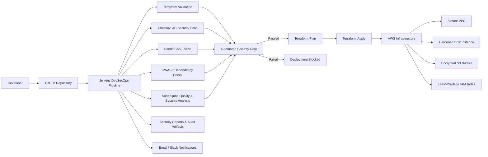

# DevSecOps CI/CD Security Pipeline

Production-style DevSecOps project demonstrating a secure CI/CD pipeline for a Flask application and AWS infrastructure. The pipeline applies shift-left security controls across infrastructure-as-code, application code, dependencies, container packaging, and deployment gates.

## Project Overview

This repository models an enterprise security pipeline used by Cloud Security and DevSecOps teams to prevent vulnerable code and insecure infrastructure from reaching production. Jenkins orchestrates security scans, quality gates, Terraform validation, AWS deployment, report publishing, and team notifications.

The pipeline blocks deployments when security findings exceed policy thresholds:

| Severity | Policy |
| --- | --- |
| Critical | Fail build |
| High | Fail build if greater than 0 |
| Medium | Warning if greater than 5 |
| Low | Report only |

## Architecture



See [architecture/architecture-diagram.md](architecture/architecture-diagram.md) for the full architecture notes.

## Technologies Used

- Jenkins declarative pipelines
- GitHub source control
- Terraform for AWS infrastructure
- AWS VPC, subnets, EC2, S3, IAM, security groups
- Python Flask application
- Docker
- Checkov for Infrastructure as Code scanning
- Bandit for Python SAST
- OWASP Dependency Check for dependency CVE scanning
- SonarQube for code quality, maintainability, and security hotspot review

## Key Security Features

- Automated Infrastructure-as-Code (IaC) security scanning using Checkov
- Static Application Security Testing (SAST) using Bandit
- Software Composition Analysis (SCA) using OWASP Dependency Check
- SonarQube Quality Gates and Security Hotspot review
- Security Gate enforcement to block vulnerable deployments
- Encrypted S3 storage with versioning and public access blocking
- Encrypted EC2 root volumes
- IMDSv2 enforcement for EC2 metadata protection
- Least-privilege IAM policies
- Terraform remote state management using S3 and DynamoDB locking
- Centralized security reporting through Jenkins
- Shift-Left Security practices integrated into CI/CD workflows

## Security Controls

| Control | Tool | Scope | Enforcement |
| --- | --- | --- | --- |
| IaC security scanning | Checkov | Terraform | Fails on high/critical failed checks |
| SAST | Bandit | Python source | Fails on high/critical findings |
| SCA | OWASP Dependency Check | Python dependencies | Fails on CVSS >= 7 |
| Code quality | SonarQube | Application code | Fails on quality gate failure |
| Secure deployment | Terraform | AWS | Least privilege, encryption, private networking |
| Reporting | Jenkins HTML Publisher | Security reports | Archived after every run |

## Pipeline Workflow

1. Checkout source from GitHub.
2. Validate Terraform syntax and provider configuration.
3. Run Checkov against Terraform code.
4. Install Python dependencies and run lightweight lint checks.
5. Run Bandit against Flask application code.
6. Run OWASP Dependency Check against Python dependencies.
7. Run SonarQube scanner and enforce Quality Gate.
8. Evaluate consolidated security gate thresholds.
9. Generate Terraform plan.
10. Automatically apply Terraform changes after all security and quality gates pass.
11. Build and deploy the Dockerized Flask application.
12. Publish HTML security reports and notify the team.

## Repository Layout

```text
DevSecOps-Security-Pipeline/
├── app/
│   ├── app.py
│   ├── secure_app.py
│   ├── requirements.txt
│   └── Dockerfile
├── architecture/
├── docs/
├── jenkins/
├── reports/
├── security/
└── terraform/
```

## Deployment Steps

### Prerequisites

- Jenkins with Docker, Terraform, Python 3, Checkov, Bandit, Dependency Check, and SonarScanner available
- Jenkins plugins:
  - Pipeline
  - HTML Publisher
  - SonarQube Scanner
  - AWS Credentials
  - Slack Notification or Email Extension
- AWS credentials stored in Jenkins as `aws-devsecops-deploy`
- SonarQube token stored in Jenkins as `sonarqube-token`
- S3 backend bucket and DynamoDB lock table created before first Terraform run

### Run Locally

```bash
cd DevSecOps-Security-Pipeline
python -m venv .venv
source .venv/bin/activate
pip install -r app/requirements.txt
python app/app.py
```

### Security Scans

```bash
checkov -d terraform --config-file security/checkov.yml
bandit -r app -c security/bandit.yml -f html -o reports/bandit-report.html
dependency-check.sh --project "DevSecOps Security Pipeline" --scan app --format HTML --out reports
```

### Terraform

```bash
cd terraform
terraform init
terraform validate
terraform plan -var="environment=dev"
terraform apply -var="environment=dev"
```

## Sample Results

Sample reports are included under [reports](reports):

- [sample-checkov-report.html](reports/sample-checkov-report.html)
- [sample-bandit-report.html](reports/sample-bandit-report.html)
- [sample-dependency-check-report.html](reports/sample-dependency-check-report.html)

These reports show the expected format consumed by Jenkins HTML Publisher and the security gate parser.

## Secure and Vulnerable App Versions

[app/app.py](app/app.py) intentionally includes a few insecure patterns for SAST demonstration:

- hardcoded secret
- shell execution with `shell=True`
- debug mode enabled by default
- permissive request handling

[app/secure_app.py](app/secure_app.py) contains the corrected version suitable for deployment.

## Project Outcomes

- Implemented an end-to-end DevSecOps security pipeline integrating IaC, SAST, SCA, and quality validation controls.
- Automated security validation of infrastructure and application code prior to deployment.
- Enforced policy-based security gates to prevent vulnerable code and infrastructure from reaching production environments.
- Demonstrated shift-left security practices by integrating security testing throughout the CI/CD lifecycle.
- Reduced manual security review effort through automated scanning, reporting, and deployment controls.
- Automated infrastructure provisioning and deployment through Terraform, eliminating manual deployment activities.

## Security Metrics

- 100% automated security validation before deployment
- Infrastructure scanned using Checkov before provisioning
- Application code scanned using Bandit before deployment
- Dependency vulnerabilities evaluated using OWASP Dependency Check
- Quality Gates enforced through SonarQube
- Policy-based deployment blocking for Critical and High severity findings

## Future Enhancements

- Integrate Trivy container image scanning into the CI/CD security pipeline.
- Add AWS Security Hub ingestion for pipeline findings.
- Add OPA/Rego policy checks for custom cloud security rules.
- Add signed container images with Cosign.
- Add SBOM generation with CycloneDX.
- Add ephemeral preview environments for pull requests.
- Add deployment through AWS CodeDeploy or ECS blue/green release strategy.

## Skills Demonstrated

**Cloud Security**

* AWS Security Best Practices
* IAM Least Privilege
* Encryption at Rest
* Infrastructure Security

**DevSecOps**

* CI/CD Security
* Shift-Left Security
* Security Gates
* Automated Compliance Validation

**Infrastructure as Code**

* Terraform
* AWS Resource Provisioning
* State Management
* Secure Infrastructure Design

**Application Security**

* SAST
* Dependency Vulnerability Management
* Secure Coding Practices
* Security Remediation

## Interview Talking Points

- Explain how security gates prevent drift from policy.
- Discuss why the pipeline separates warnings from deployment blockers.
- Describe how Terraform implements least privilege and encryption.
- Explain how Checkov, Bandit, Dependency Check, and SonarQube complement each other.
- Discuss how the pipeline can be extended with container scanning, SBOMs, and runtime monitoring.
