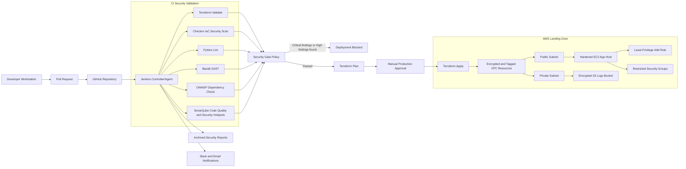

# Architecture Diagram

This architecture shows a shift-left DevSecOps workflow where Jenkins orchestrates source checkout, security scanning, security gate enforcement, Terraform deployment, application packaging, report publishing, and team notifications.

## Design Notes

- GitHub is the source of truth for application and infrastructure code.
- Jenkins agents run all security scans before deployment.
- Checkov validates Terraform against cloud security policies.
- Bandit detects insecure Python implementation patterns.
- OWASP Dependency Check detects vulnerable open-source packages.
- SonarQube enforces quality gates and tracks maintainability/security hotspots.
- Terraform provisions AWS infrastructure with encryption, logging, tagging, and least privilege.
- Jenkins publishes reports regardless of pass/fail outcome so failed builds remain auditable.
